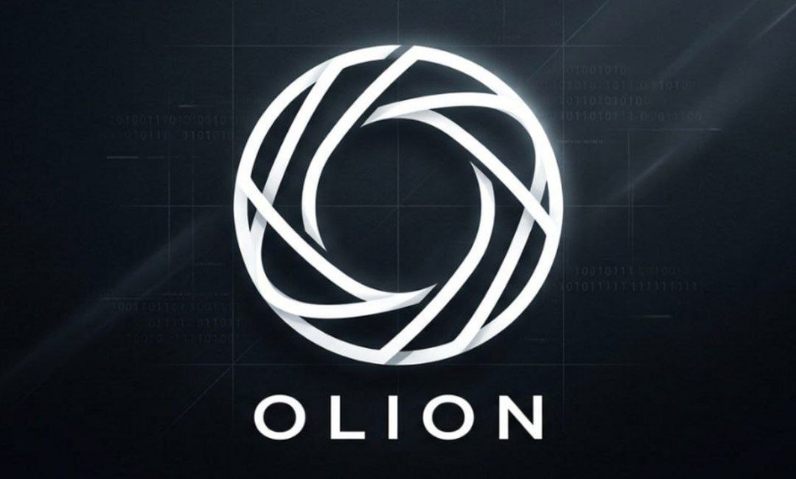
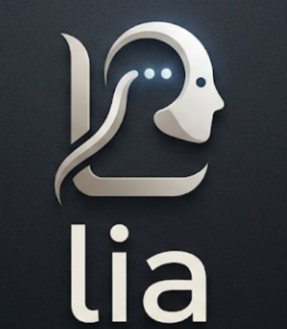

## OLION – Anonymous Discussion Platform X LIA - Retrieval-Augmented Generation Chatbot untuk OLION






---
Akses di [https://olion.vercel.app](https://olion.vercel.app)

| email          | password     |
| -------------- | ------------ |
| user1@olion.id | Password123! |
| user1 sd 12    | Password123! |
| mod@olion.id   | -----        |
| pakar@olion.id | -----        |
| admin@olion.id |              |

---

### Clone repository:

```bash
git clone https://github.com/zerocool979/olion.git
cd olion
```

### Backend

```bash
cd backend && npm install && cp .env.example .env && npm run migrate && npm run seed && npm run dev
```
> _"Backend running on http://localhost:4000"_

### Prisma studio

```bash
cd olion/backend && npx prisma studio
```
> _"Prisma Studio is up on http://localhost:5555"_

### Frontend

```bash
cd frontend && npm install && npm run dev
```
> _"Access the page at http://localhost:3000"_
