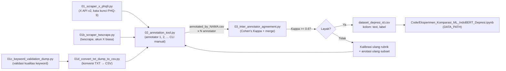

# README — Pipeline Pengumpulan & Pelabelan Data (Data_Collection/)

Enam skrip ini mengimplementasikan **Batasan Masalah [[03_Proposal_Penelitian#5. Batasan Masalah|§5 Proposal]]  secara end-to-end dan telah **diuji fungsional (smoke test) hingga lolos**: scraping → anotasi manual → Cohen's Kappa → dataset final `text,label` yang siap dipakai sebagai `DATA_PATH` pada [[../Code/Eksperimen_Komparasi_ML_IndoBERT_Depresi.ipynb|notebook eksperimen]].

## Alur Pipeline




## 1. `01_scraper_x_phq9.py` — Scraping
- Menggunakan **X API v2 resmi** (pustaka `tweepy`) — bukan scraping yang melanggar ToS/bypass anti-bot.
- 9 kategori kata kunci mengikuti 9 domain gejala **PHQ-9**, diadaptasi ke ekspresi kolokial Bahasa Indonesia (lihat tabel di bawah).
- Output: CSV mentah **belum berlabel** (`tweet_id, created_at, lang, matched_category, text`).
- Mode `--demo` tersedia untuk menguji seluruh pipeline tanpa API key (data sintetis).

```bash
pip install tweepy pandas
export X_BEARER_TOKEN="xxxxxxxxxxxx"     # dari https://developer.x.com
python 01_scraper_x_phq9.py --max-per-category 150 --output raw_scraped_posts.csv
```

### Tabel 9 Domain Kata Kunci PHQ-9
| #   | Domain PHQ-9                 | Contoh Kata Kunci (id)                                        |
| --- | ---------------------------- | ------------------------------------------------------------- |
| 1   | Anhedonia                    | "gak ada minat ngapa-ngapain", "udah gak excited sama apapun" |
| 2   | Mood sedih                   | "sedih terus tanpa alasan", "ngerasa hampa banget"            |
| 3   | Gangguan tidur               | "susah tidur belakangan ini", "insomnia parah"                |
| 4   | Kelelahan                    | "capek terus padahal gak ngapa-ngapain"                       |
| 5   | Nafsu makan                  | "gak nafsu makan sama sekali", "berat badan turun drastis"    |
| 6   | Rasa bersalah/tidak berharga | "ngerasa gak berharga", "ngerasa jadi beban"                  |
| 7   | Konsentrasi                  | "susah fokus belakangan ini"                                  |
| 8   | Psikomotor                   | "gelisah terus gak jelas", "lemot banget gerak-gerak"         |
| 9   | Ide bunuh diri               | "pengen menghilang aja", "capek banget sama hidup"            |

> Akses API: tier gratis X API v2 sangat terbatas (umumnya tanpa akses pencarian). Untuk volume memadai gunakan tier **Basic/Pro** (berbayar) atau akses institusi/akademik bila tersedia.


## 1b. `01b_scraper_twscrape.py` — Scraping via twscrape (Alternatif Tanpa X API Berbayar)
- Berfungsi sebagai **pengganti `01_scraper_x_phq9.py`** ketika akses pencarian pada X API v2 tidak tersedia atau memerlukan langganan berbayar.
- Menggunakan pustaka **twscrape** yang memanfaatkan endpoint internal yang sama dengan aplikasi web X.
- Hanya memerlukan akun X biasa (username/password atau cookies `auth_token` + `ct0`).
- Output **identik** dengan scraper utama: `tweet_id, created_at, lang, matched_category, text` sehingga langsung kompatibel dengan `02_annotation_tool.py`.
- Menyediakan fitur tambahan:
  - `--setup` untuk registrasi akun.
  - `--test-keywords` untuk memvalidasi kata kunci sebelum scraping skala besar.
  - `--demo` untuk menghasilkan data sintetis tanpa akun X.
  - Dukungan login menggunakan **cookies** untuk mengurangi kegagalan akibat Cloudflare.

```bash
pip install twscrape

# Setup akun (sekali saja) dan ambil cookies HANYA milikmu
python 01b_scraper_twscrape.py --setup \
    --username akun_x \
    --password password_x \
    --email email@domain.com \
    --cookies "auth_token=MILIK_KAMU; ct0=MILIK_KAMU"
# Scraping
python 01b_scraper_twscrape.py \
    --max-per-category 150 \
    --output raw_scraped_posts.csv

# Validasi kata kunci sebelum scraping besar
python 01b_scraper_twscrape.py \
    --test-keywords \
    --sample-limit 5
```

> Direkomendasikan menggunakan login berbasis **cookies (`auth_token` dan `ct0`)** apabila login otomatis melalui username/password mengalami pemblokiran Cloudflare.


## 1c. `01c_keyword_validation_dump.py` — Dump Hasil Pencarian Kata Kunci

- Digunakan untuk **validasi manual kualitas kata kunci** sebelum scraping massal.
- Menjalankan satu query kategori tertentu dan menampilkan seluruh tweet yang ditemukan.
- Memperlihatkan metadata penting (`tweet_id`, tanggal, username, display name, dan isi tweet penuh).
- Cocok digunakan saat menyempurnakan daftar kata kunci PHQ-9 dan mengevaluasi relevansi hasil pencarian.
- Output dapat diarahkan ke file teks untuk proses review:

```bash
python 01c_keyword_validation_dump.py > anhedonia.txt
```

Atau:

```bash
python 01c_keyword_validation_dump.py >> anhedonia.txt
```

Workflow yang direkomendasikan:

1. Tentukan kategori dan daftar kata kunci.

```bash
$ cat 01c_keyword_validation_dump.py | grep -n "category"
21:    category = "anhedonia"
$ cat 01c_keyword_validation_dump.py | grep -n "keywords"
22:    keywords = [
```

2. Jalankan `01c_keyword_validation_dump.py` dengan menyesuaikan nama file output.
3. Tinjau hasil pada file `.txt`.
4. Perbaiki kata kunci yang menghasilkan banyak false positive.
5. Setelah valid, gunakan `01b_scraper_twscrape.py --test-keywords` dan lanjutkan scraping utama.


## 1d. `01d_convert_txt_dump_to_csv.py` — Konversi Dump TXT Menjadi CSV

- Digunakan untuk mengubah hasil dump dari `01c_keyword_validation_dump.py` menjadi dataset CSV yang kompatibel dengan pipeline anotasi.
- Membaca seluruh file `*.txt` pada direktori kerja.
- Mengekstrak: `tweet_id`, `created_at`, `text`, kategori berdasarkan nama file
- Menambahkan kolom:`lang = id`
- Membersihkan teks: menghapus URL dan merapikan whitespace
- Menghapus duplikasi berdasarkan `tweet_id`.    
- Menormalkan kategori yang berasal dari eksperimen kata kunci, misalnya:

| Nama File              | Kategori Hasil   |
| ---------------------- | ---------------- |
| `ide_bunuh_diri.txt`   | `ide_bunuh_diri` |
| `ide_bunuh_diri01.txt` | `ide_bunuh_diri` |
| `ide_bunuh_diri02.txt` | `ide_bunuh_diri` |

Output:

```text
raw_scraped_posts.csv
```

Skema output:

```text
tweet_id,created_at,lang,matched_category,text
```

Contoh penggunaan:

```bash
pip install pandas

python 01d_convert_txt_dump_to_csv.py
```

Contoh workflow:

```text
01c_keyword_validation_dump.py
            ↓
anhedonia.txt
mood_sedih.txt
dst...
            ↓
01d_convert_txt_dump_to_csv.py
            ↓
raw_scraped_posts.csv
            ↓
02_annotation_tool.py
```

Script ini berguna ketika proses eksplorasi dan validasi kata kunci dilakukan secara manual melalui dump TXT sebelum data dimasukkan ke tahap anotasi.

## 2. `02_annotation_tool.py` — Anotasi Manual
- **Wajib dijalankan oleh ≥2 annotator manusia berbeda** (mis. 2 mahasiswa terlatih + idealnya 1 orang berlatar psikologi, mengikuti pola Papers/P02).
- CLI interaktif dengan **rubrik 4 kelas** ditampilkan di awal, **content warning** otomatis muncul untuk kategori `ide_bunuh_diri`.
- Progres tersimpan inkremental (tiap 10 baris + saat keluar `q`) → bisa dijeda kapan saja, lanjut otomatis dari posisi terakhir.

```bash
python 02_annotation_tool.py --input raw_scraped_posts.csv --annotator andi
python 02_annotation_tool.py --input raw_scraped_posts.csv --annotator budi
```

## 3. `03_inter_annotator_agreement.py` — Kappa & Penggabungan Final
- Menghitung **Cohen's Kappa** tiap pasangan annotator + confusion matrix antar-annotator.
- Ambang kelayakan: **Kappa ≥ 0.6** (sesuai [[04_Desain_Eksperimen# 4. Spesifikasi Instrumen|§4 Desain Eksperimen]]). Di bawah ambang ini → kalibrasi ulang rubrik dianjurkan sebelum lanjut.
- Baris yang labelnya **disepakati semua annotator** → otomatis masuk dataset final.
- Baris yang **berselisih** → diekspor ke `disagreements_for_adjudication.csv`; jika disediakan file `--adjudicator` (keputusan supervisor), baris tsb diisi dari sana — jika tidak, baris dibuang (lebih aman daripada voting otomatis pada domain sensitif ini).

```bash
python 03_inter_annotator_agreement.py \
    --annotators annotated_by_andi.csv annotated_by_budi.csv \
    --adjudicator annotated_by_supervisor.csv \
    --output dataset_depresi_id.csv
```

Output akhir `dataset_depresi_id.csv` **berkolom tepat `text,label`** dengan nilai label persis `Tidak Ada/Ringan/Sedang/Berat` — identik dengan `LABELS` pada notebook, **tidak perlu transformasi tambahan apa pun**.

## Status Pengujian
Lima skrip utama (`01_scraper_x_phq9.py`, `01b_scraper_twscrape.py`, `01c_keyword_validation_dump.py`, `01d_convert_txt_dump_to_csv.py`, dan 02/03 pipeline anotasi) telah melalui smoke test fungsional end-to-end (bukan hanya cek sintaks): scraper mode demo → 2 annotator simulasi (termasuk 1 kasus berselisih) → Kappa terhitung benar (0,77) → dataset final terverifikasi 100% kompatibel dengan skema yang dibutuhkan notebook (`{"text","label"}.issubset(columns)` dan nilai label ⊆ `LABELS`).

## Catatan Etika Penelitian (Wajib Dibaca)
1. **Persetujuan etik** — karena topik menyangkut data kesehatan mental, ajukan kaji etik (komite etik/IRB) institusi Anda sebelum pengumpulan data berskala besar, meskipun datanya berasal dari unggahan publik.
2. **Privasi** — skrip ini tidak menyimpan nama pengguna; `tweet_id` hanya disimpan untuk keperluan internal pencocokan anotasi. **Hapus kolom `tweet_id` sebelum membagikan dataset secara publik.**
3. **Bukan alat diagnostik** — selaras dengan catatan eksplisit pada [[../Papers/P03_Siswandi_Susilo_2026|P03]], dataset & model yang dihasilkan dari pipeline ini bersifat eksploratif untuk riset pola linguistik, **bukan pengganti diagnosis klinis profesional**.
4. **Kesejahteraan annotator** — annotator berpotensi terpapar konten yang mengandung tekanan emosional/ide bunuh diri. Rotasi annotator, jeda berkala, dan akses ke dukungan kesehatan mental institusi dianjurkan.

---
🔗 Terkait: [[../03_Proposal_Penelitian]] · [[../04_Desain_Eksperimen]] · [[../00_README]]
